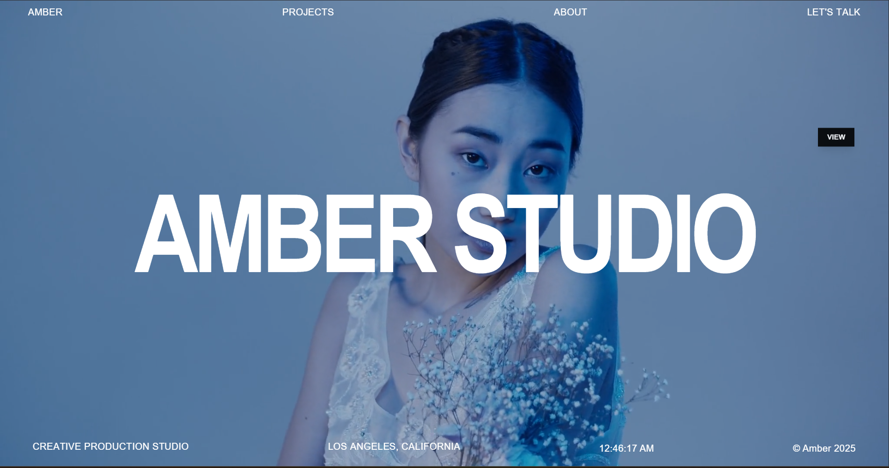
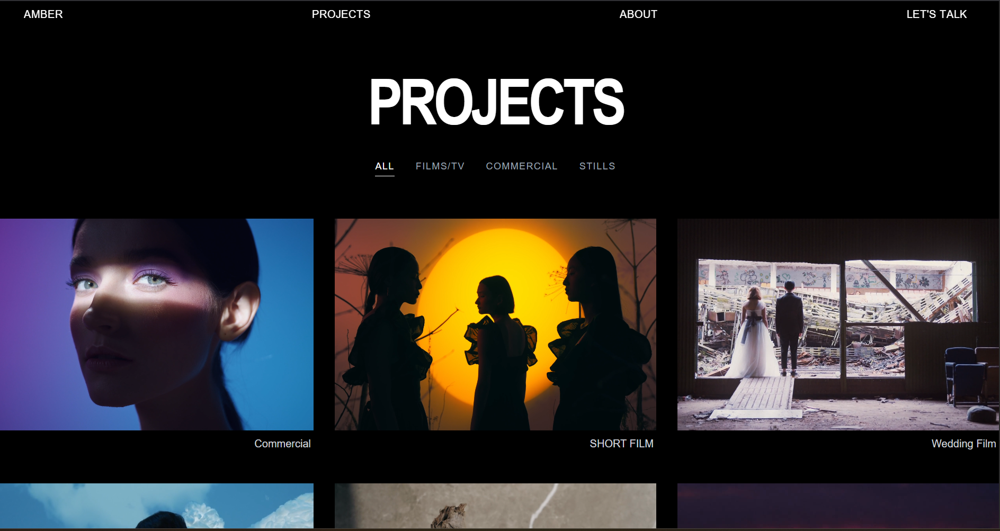
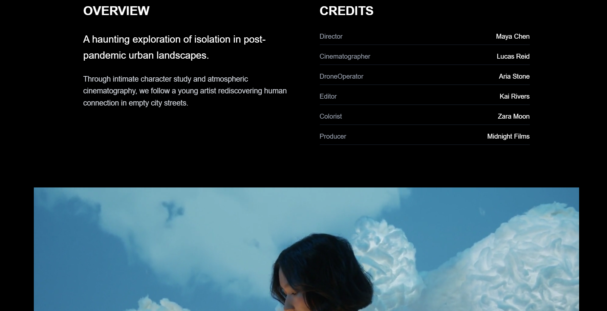

# Amber Films - Cinematic Storytelling Studio Website










### 🎨 Design & Aesthetics
- **Dark Cinematic Theme** - Professional black and gray color palette
- **Elegant Typography** - Clean, modern fonts with sophisticated hierarchy
- **Responsive Design** - Mobile-first approach ensuring perfect viewing on all devices
- **Smooth Animations** - Subtle hover effects and transitions for enhanced user experience

### 📱 Core Sections
- **Hero Landing** - Dramatic introduction with mission statement overlay
- **About Section** - Comprehensive studio story with statistics and credentials
- **Team Profiles** - Individual member showcases with professional photography
- **Awards & Recognition** - Industry accolades and publication features
- **Client Portfolio** - Premium brands and collaboration highlights
- **Project Showcase** - Visual storytelling gallery (expandable)

### 🛠️ Technical Features
- **Component-Based Architecture** - Modular React components for maintainability
- **Image Optimization** - Efficient loading and display of high-quality visuals
- **Interactive Elements** - Engaging user interactions without overwhelming the content
- **Professional Layout** - Grid systems optimized for visual hierarchy

## 🚀 Technologies Used

- **Frontend Framework:** React with functional components and hooks
- **Styling:** Tailwind CSS with custom utility classes
- **Icons:** Lucide React for consistent iconography
- **Image Handling:** Optimized public folder structure
- **Responsive Design:** Mobile-first CSS approach
- **State Management:** React useState for interactive elements

## 📦 Installation

### Prerequisites
- Node.js (version 14 or higher)
- npm or yarn package manager

### Setup Instructions

1. **Clone the repository:**
   ```bash
   git clone https://github.com/yourusername/amber-films.git
   cd amber-films
   ```

2. **Install dependencies:**
   ```bash
   npm install
   # or
   yarn install
   ```

3. **Add your images:**
   - Place team photos and studio images in the `public/` folder
   - Ensure images are named: `1.png`, `2.png`, `3.png`, `4.png` (or update paths in components)

4. **Run the development server:**
   ```bash
   npm run dev
   # or
   yarn dev
   ```

5. **Open your browser:**
   Navigate to `http://localhost:3000` to view the website

## 📄 License

MIT License - see [LICENSE](LICENSE) for details.

## 🤝 Contributing

1. Fork the repository
2. Create a feature branch (`git checkout -b feature/amazing-feature`)
3. Commit your changes (`git commit -m 'Add amazing feature'`)
4. Push to the branch (`git push origin feature/amazing-feature`)
5. Open a Pull Request

---
